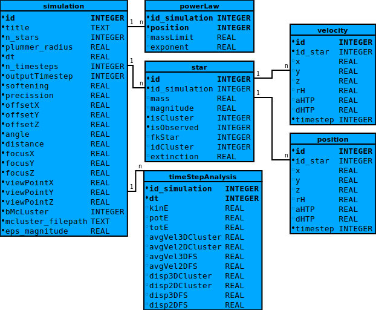

========
Database
========

A SQLite Database is used to store simulations including all relevant parameters, stars with their respective positions and velocities as well as data resulting from analysis.
SQLite supports both C++ and python. And is therefor used in most data related parts of the project. Generated data can be loaded and plotted directly from the database.
Simulations, which have been performed, can be loaded from the database to perform analysis like energy vs time or average star velocity vs time.
The separation of simulation and analysis in the database is justified by the code base where they are represented by separate classes.
Performing analysis during simulation would lead to ugly code or low performance.

Entity Relationship Diagram
---------------------------

Database Interface
------------------

Interactions with the database are handled by the Database class

.. doxygenclass:: Database
   :members:
