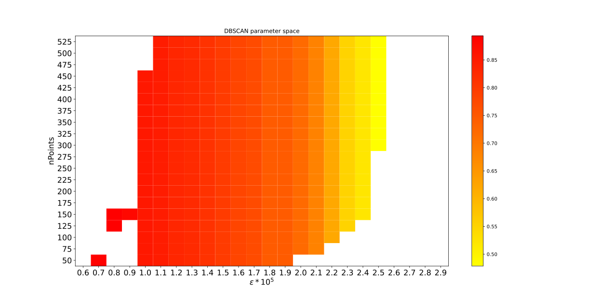

===========
Experiments
===========

Parameter optimization
----------------------

.. _fig-DBSCAN:

    Precision depending on DBSCAN parameters

The quality of the cluster analysis with DBSCAN depends on the choice for its parameters.
:numref:`fig-DBSCAN` depicts the precision for a :math:`1 kM_\odot` cluster :math:`300 \textup{[pc]}` from the GC.
Decreasing :math:`\epsilon` leads to a higher precission untill it is too small, at which point multiple clusters are detected.
Based on this observation :math:`\epsilon` was set to :math:`1.1*10^{-5}` and nPoints to 200 for all simulations.

Setup
-----

A total of 25 simulations with varying focus and cluster mass were carried out and in order to study the effects of these parameters on the cluster detection performance.
Each simulation was repeated 10 times for error estimation.

Parameters
^^^^^^^^^^

The following parameters remained unchanged between the simulations.

**General simulation parameters**

* | FOV angle: :math:`54 \textup{[arcsec]}`
  | The field of view angle, chosen large enough to cover most of cluster with the highest mass. See :math:`\alpha` in :numref:`fig-cone`
* | View distance: :math:`9 \textup{[kpc]}`
  | The height of the COV or line of sight distance reaching behind the GC when looking towards it.
* | Cluster distance: :math:`8 \textup{[kpc]}`
  | The distance between the observer and the cluster. When looking straight at the GC the distance between the cluster and the GC is :math:`300 \textup{[pc]}` 
* | View point: :math:`\begin{bmatrix}8300 & 0 & 27\end{bmatrix}^{T}_{GCA} \textup{[kpc]}`
  | The position of the observer in GCA.
* | Timestep: :math:`28 \textup{[day]}`
  | Amount of time between the two recorded snapshots. The time per integration is :math:`7 \textup{[day]}`. Therefor snapshots are taken every 4 integrations.

**Cluster specific parameters (McLuster)**

* (P) Profile: 0 Plummer density profile
* | (R) Radius: -1
  | With this setting the radius is calculated by mcluster via a mass to half-mass radius relation as described in :cite:`Marks2012`
* | (Q) Virial ratio: 0.5 
  | The cluster is in virial equlibrium.
* (f) IMF: 1 Kroupa ranging from 0.08 Msun to 100 Msun
* (C) Output: 3 The resulting mass, position and velocity for each star is written into a file.

five different FOV angles (180°,25,10, 5, 0  ) and cluster masses (0.64, 1.6, 4.0, 10, 25)

ToDo: Continue here (25 observations)