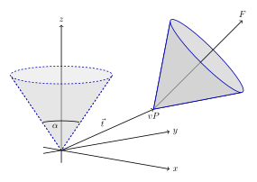

==============
Initialization
==============

Initial Mass Function (IMF)
---------------------------

Salpeter (1955)
^^^^^^^^^^^^^^^

.. doxygenfunction:: InitialConditions::initialMassSalpeter

.. plot:: pyplots/initialConditionsMassSalpeter.py

Background

When it comes to sampling an IMF, one possible approach is called inverse transform sampling. Here one must integrate the IMF over the mass, yielding a cumulative probability function (cpf), and normalize it (ncpf).
Then one has to take the inverse of the ncpf. Since Salpeter is a power-law distribution function all this can be done analytically:

 https://www.usna.edu/Users/cs/crabbe/SI475/current/particleFilter/particleFilter.pdf
 https://local.strw.leidenuniv.nl/events/phdtheses/haas/05.pdf

.. math::
    p(m)=\frac{dN}{dm}=A*m^{-\alpha }
    :label: salpeter

    P(m)=\int_{m_{min}}^{m}A*m^{-\alpha } dm = \frac{A}{-\alpha +1}\left ( m^{-\alpha +1} -m_{min}^{-\alpha +1}\right )

A is defined by normalization:

.. math::
    P({m_{max}})\equiv 1\rightarrow A=\frac{-\alpha +1}{m_{max}^{-\alpha +1} -m_{min}^{-\alpha +1} }

Inserting this into P(m) yields:

.. math::
    P(m)=\frac{m^{-\alpha +1} -m_{min}^{-\alpha +1}}{m_{max}^{-\alpha +1} -m_{min}^{-\alpha +1}}

Inverting this function and some simplifications lead to:

.. math::
    m_{rand} = m_{min}*\left [ 1+x*\left ( \left ( \frac{m_{max}}{m_{min}} -1\right )^{-\alpha +1} \right ) \right ]^{\frac{1}{-\alpha +1}}

where x is a random number in range [0,1]

broken power law
^^^^^^^^^^^^^^^^

As with Salpeter, inverse transform sampling is used.

.. math::
    \xi(m)=m^{-\alpha(m)}

where :math:`\alpha(m)` is a piecewise constant function with :math:`n-1` intervals.

.. math::
    \alpha(m)=\begin{cases}
       \ \alpha_{1} &\quad\text{if }m_{1}\leqslant m< m_{2}\\
       \ \alpha_{2} &\quad\text{if }m_{2}\leqslant m< m_{3}\\
       \ ...  \\
       \ \alpha_{n-1} &\quad\text{if }m_{n-1}\leqslant m< m_{n}\\
     \end{cases}

The normalized cumulative distribution function (ncdf) can be calculated by integrating :math:`\xi(m)` over the mass interval and introducing a normalization constant :math:`A`.

.. math::
    F(m)=A\int_{m_{1}}^{m}m^{-\alpha(m)}\,dm

.. math::
    A * \sum_{i=1}^{n-1} \left ( \int_{m_{i}}^{m_{i+1}}m^{-\alpha_{i}}\,dm \right ) = 1

Inverting the ncdf leads to

.. math::
    F^{-1}(y)=
     \begin{cases}
       \ \left [ \frac{(1-\alpha_{1})y}{A} +m_{1}^{1-\alpha_{1}}\right ]^{\frac{1}{1-\alpha_{1}}} &\quad\text{if }0\leqslant y< \frac{A}{1-\alpha_{1}}\left ( m_{2}^{1-\alpha_{1}}-m_{1}^{1-\alpha_{1}} \right )\\
       \ \left \{ \left [\frac{A}{ \alpha_{1}-1}\left ( m_{2}^{1-\alpha_{1}}-m_{1}^{1-\alpha_{1}}+y \right )\right ]  \frac{1-\alpha_{2}}{A} - m_{2}^{1-\alpha_{1}} \right \}^{\frac{1}{1-\alpha_{2}}} &\quad\text{if }\frac{A}{1-\alpha_{1}}\left ( m_{2}^{1-\alpha_{1}}-m_{1}^{1-\alpha_{1}} \right )\leqslant y< \sum_{i=1}^{2}\frac{A}{1-\alpha_{i}}\left ( m_{i+1}^{1-\alpha_{i}}-m_{i}^{1-\alpha_{i}} \right )\\
       \ ...  \\
       \ \left \{ \left [ \sum_{i=1}^{n-2} \frac{A}{ \alpha_{i}-1}\left ( m_{i+1}^{1-\alpha_{i}}-m_{i}^{1-\alpha_{i}} \right )+y\right ]  \frac{1-\alpha_{n-1}}{A} - m_{n-1}^{1-\alpha_{n-1}} \right \}^{\frac{1}{1-\alpha_{n-1}}} &\quad\text{if }\sum_{i=1}^{n-2}\frac{A}{1-\alpha_{i}}\left ( m_{i+1}^{1-\alpha_{i}}-m_{i}^{1-\alpha_{i}} \right )\leqslant y< \sum_{i=1}^{n-1}\frac{A}{1-\alpha_{i}}\left ( m_{i+1}^{1-\alpha_{i}}-m_{i}^{1-\alpha_{i}} \right )=1\\
     \end{cases}

where y is a random number in range [0,1]

.. doxygenfunction:: InitialConditions::brokenPowerLaw

Spheroid/Bulge - Chabrier (2003)
^^^^^^^^^^^^^^^^^^^^^^^^^^^^^^^^^^

.. doxygenfunction:: InitialConditions::bulgeIMF

.. plot:: pyplots/initialConditionsMassBulge.py

Per rejection sampling the following function, given by :cite:`2003PASP..115..763C`, the mass of stars, which belong to the bulge, is determined.

For :math:`m<0.7` the log-normal distribution equation :eq:`lognormal` is used. Parameters are :math:`A=3.6*10^{-4}`, :math:`m_{c}=0.22` and :math:`\sigma=0.33`.
For :math:`m>0.7` a Salpeter slope :eq:`salpeter` with parameters :math:`A=7.1*10^{-5}` and :math:`x=1.3` is chosen.

Present Day Mass Function (PDMF)
--------------------------------

.. Bulge: (m>1) http://adsabs.harvard.edu/full/1999A%26A...348..457M (m<1) https://hubblesite.org/uploads/science_paper/file_attachment/200/pdf.pdf

Disk Stellar Mass Function
^^^^^^^^^^^^^^^^^^^^^^^^^^

.. doxygenfunction:: InitialConditions::diskIMF

.. plot:: pyplots/initialConditionsMassDisk.py

Stars belonging to the disk are given a mass by rejection sampling the PDMF as given by :cite:`2003PASP..115..763C`.

For :math:`m<1` the PDMF reads

.. math::
    \xi\left(\mathrm{log}(m)\right) = \frac{\mathrm{dN}}{\mathrm{dlog}(m))} = A*\mathrm{exp}[ \frac{-( \mathrm{log}(m) -\mathrm{log}( m_{c} ))^{2} }{2 \sigma^{2}}]
    :label: lognormal

or equivalently (this version is sampled)

.. math::
    \xi\left(m\right) = \frac{\mathrm{dN}}{\mathrm{dm}} = \frac{A}{m\mathrm{ln}(10)}*\mathrm{exp}[ \frac{-( \mathrm{log}(m) -\mathrm{log}( m_{c} ))^{2} }{2 \sigma^{2}}]

For :math:`m>1` the PDMF has the form

.. math::
    \xi\left(\mathrm{log}(m)\right) = \frac{\mathrm{dN}}{\mathrm{dlog}(m))} = A m^{-x}

or depending on :math:`m` rather than :math:`\mathrm{log}(m)`

.. math::
    \xi\left(m\right) = \frac{\mathrm{dN}}{\mathrm{dm}} = \frac{A}{m\mathrm{ln}(10)} m^{-x}

Positions
---------

Field star positions within the cone of vision are sampled directly from the density via rejection sampling.
The cone of vision is defined by the angle of view :math:`\alpha`, the view distance (height of the cone), the view point :math:`vP` (location of the observer) and the focus :math:`F` (a point along the line of sight).

Trial positions are drawn from continuous uniform distributions with bounds of an upside down cone which axis aligned with the z axis

.. math::
    |x|\leq R \\
    |y|\leq \sqrt{R^{2}-x^{2}} \\
    \frac{h}{R}\sqrt{x^{2}+y^{2}}\leq z\leq h

and then transformed via a transformation matrix.
Per this transformation the tip of the cone is displaced from the origin to the view point :math:`vP` and its axis is rotated to align with the line of sight :math:`l`.
Consequently, the transformation consists of both translation and rotation illustrated in the following figure.

    Transformation of the cone of vision

A unit quaterion :math:`\textbf{q}` is used in order to construct the rotation matrix. With rotation axis :math:`\vec{b}` and angle :math:`\beta` the quaternion is given by

.. math::
    \textbf{q} = \left ( \textup{cos}\left (\frac{\beta}{2}\right ), \vec{b}\textup{ sin}\left ( \frac{\beta}{2} \right )\right )

The rotation axis :math:`\vec{b}` is the normalized cross product of the original (:math:`\vec{z}`) and target (:math:`l`) cone axis

.. math::
    \vec{b}=\frac{\vec{z}\times\vec{l}}{\left \| \vec{z}\times\vec{l} \right \|}

The angle :math:\frac{\beta} between the vectors of interest can be calculated as follows

.. math::
    \beta
    =\textup{atan2}\left ( \textup{tan}\left ( \beta \right ) \right )
    =\textup{atan2}\left ( \frac{\textup{sin}\left ( \beta \right )}{\textup{cos}\left ( \beta \right )} \right )
    =\textup{atan2}\left ( \frac{\left \| \vec{z}\times\vec{l} \right \|}{\vec{z}\cdot \vec{l}} \right )

Next, quarterion is converted to the rotation matrix like so:

.. math::

Since the dot product of two vectors is the product of their magnitudes and the cosine of the angle between them and because

.. doxygenfunction:: InitialConditions::sampleDiskPositions(std::vector<Star *>, Vec3D, Vec3D, double, double, Matrix *)

.. doxygenfunction:: InitialConditions::sampleBulgePositions(std::vector<Star *>, Vec3D, Vec3D, double, double, Matrix *)

.. plot:: pyplots/potentialPositions.py

.. bibliography:: bibtex.bib
