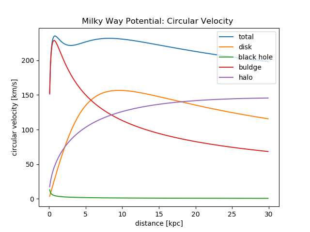

==================
Galactic Potential
==================

https://iopscience.iop.org/article/10.1088/0004-637X/794/1/4
https://academic.oup.com/mnras/article/487/3/4025/5511782
(halo irrelevant(?)): https://arxiv.org/abs/1907.13132)
(MWPotential2014) https://arxiv.org/pdf/1412.3451.pdf
(more on dark halo) https://www.researchgate.net/publication/316334286_Mass_Distribution_and_Gravitational_Potential_of_the_Milky_Way
(another galactic potential) http://www.astro.utu.fi/~cflynn/galdyn/lecture4.html
(halo from here if needed: https://iopscience.iop.org/article/10.1088/0004-637X/794/1/4)
(Measurements of circular velocity) https://arxiv.org/pdf/1810.09466.pdf
(circular velocity, using derivation) https://www.researchgate.net/publication/316680117_GalRotpy_an_educational_tool_to_understand_and_parametrize_the_rotation_curve_and_gravitational_potential_of_disk-like_galaxies

The potential consists of four parts: black hole, buldge, disc and the dark matter halo.

The black hole is represented by a Keplerian potential:

..  math::
    \Phi_{bh}\left ( r \right ) = -\frac{G*M_{bh}}{r}
with :math:`r` being the spherical radius.

the disk can be modeled via a Miyamoto Nagai potential

.. math::
    \Phi_{disk}\left ( R,z \right ) = -\frac{G*M_{disk}}{\sqrt{R^{2+\left ( a_{disk}+\sqrt{z^{2}+b_{disk}^{2}} \right )^{2}}}}
with :math:`R` the cylindrical radius and with :math:`z` the distance to the reference plane

for the buldge the Hernquist potential is used

.. math::
    \Phi_{buldge}\left ( r \right ) = -\frac{G*M_{buldge}}{\left ( r+a_{buldge} \right )}
:math:`a` is the scale-length of the spheroid potential

and NFW potential is used for the halo potential

.. math::
    \Phi_{halo}\left ( r \right ) = \frac{-4\pi G\rho _{s}r_{s}^{3}\ln\left ( 1+\frac{r}{r_{s}}\right )}{r}
where :math:`\rho _{s}` is the characteristic density and :math:`r_{s}` the scale length.

Parameters of choice are:
(rs: https://arxiv.org/pdf/1412.3451.pdf)
(others: https://iopscience.iop.org/article/10.1088/0004-637X/714/1/229)

.. csv-table:: Parameters
   :header: "Parameter", "Value", "Unit"
   :widths: 20, 20, 10

   :math:`M_{bh}`, :math:`4*10^{6}`, :math:`M_\odot`
   :math:`M_{disk}`, :math:`10^{11}`, :math:`M_\odot`
   :math:`a_{disk}`, :math:`6.5`, :math:`kpc`
   :math:`b_{disk}`, :math:`0.26`, :math:`kpc`
   :math:`M_{buldge}`, :math:`3.4*10^{10}`, :math:`M_\odot`
   :math:`a_{buldge}`, :math:`0.70`, :math:`kpc`
   :math:`r_{s}`, :math:`16`, :math:`kpc`

:math:`\rho _{s}` can be determined by imposing

.. math::
   v_{c}\left ( R_{0},z=0 \right ) = 220\left [ \frac{km}{s} \right ]

   R_{0} = 8 \left [ kpc \right ]

The circular velocity :math:`v_{c}` is defined via

.. math::
   v_{c}\left ( R,z \right ) = \sqrt{R\frac{\partial \Phi \left (R,z  \right )}{\partial R}   }

with in the presented case total potential being

.. math::
   \Phi \left ( R,z \right ) = \Phi_{bh} \left ( R,z \right )+\Phi_{disk} \left ( R,z \right )+\Phi_{buldge} \left ( R,z \right )+\Phi_{halo} \left ( R,z \right )

therefor

.. math::
   v_{c}^{2} = v_{c,bh}^{2}+v_{c,disk}^{2}+v_{c,buldge}^{2}+v_{c,halo}^{2}

   v_{c,bh}^{2} = \frac{G M_{bh} R^2}{\left(R^2+z^2\right)^{3/2}}

   v_{c,disk}^{2} = \frac{GM_{disk}R^2}{\left(\left(a_{disk}+\sqrt{b_{disk}^2+z^2}\right)^2+R^2\right)^{3/2}}

   v_{c,buldge}^{2} = \frac{G M_{buldge} R^2}{\sqrt{R^2+z^2} \left(a_{buldge}+\sqrt{R^2+z^2}\right)^2}

   v_{c,halo}^{2} = \frac{4 \pi G \rho _{s} R^2 r_{s}^3 \log \left(\frac{\sqrt{R^2+z^2}}{r_{s}}+1\right)}{\left(R^2+z^2\right)^{3/2}}-\frac{4\pi G\rho_{s} R^2 {r_{s}}^2}{\left(R^2+z^2\right) \left(\frac{\sqrt{R^2+z^2}}{r_{s}}+1\right)}

.. math::
   v_{c}^{2}=R\left ( \frac{G M_{bh} R}{\left(R^2+z^2\right)^{3/2}}+
   \frac{GM_{disk}R}{\left(\left(a_{disk}+\sqrt{b_{disk}^2+z^2}\right)^2+R^2\right)^{3/2}}+
   \frac{G M_{buldge} R}{\sqrt{R^2+z^2} \left(a_{buldge}+\sqrt{R^2+z^2}\right)^2}+
   \frac{4 \pi G \rho _{s} R r_{s}^3 \log \left(\frac{\sqrt{R^2+z^2}}{r_{s}}+1\right)}{\left(R^2+z^2\right)^{3/2}}-\frac{4\pi G\rho_{s} R {r_{s}}^2}{\left(R^2+z^2\right) \left(\frac{\sqrt{R^2+z^2}}{r_{s}}+1\right)} \right )

plugging in all the parameters (and :math:`G\approx 4.302*10^{-6}\left [ \frac{kpc}{M_\odot}\frac{km^{2}}{s^{2}} \right ]`) results in :math:`\rho_{s}\approx 4.5*10^{6} \left [ \frac{M_\odot}{kpc^{3}} \right ]`

"Junk"

Halo potential given by (https://iopscience.iop.org/article/10.1088/0004-637X/714/1/229)

.. math::
    \Phi_{halo}\left ( x,y,z \right ) = v_{halo}^{2}*\ln\left ( C_{1}*x^{2}+C_{2}*y^{2}+C_{3}*x*y +\left (\frac{z}{q_{z}}  \right )^{2}+r_{halo}^{2}\right )

    \Phi_{halo}\left ( r \right ) = \frac{1}{2}v_{halo}^{2}\ln\left ( r^{2}+r_{halo}^{2}\right )
