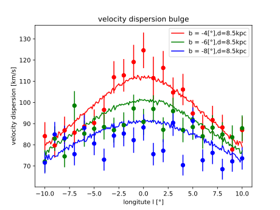

==============
Initialization
==============

Sampling distribution functions
-------------------------------

Space, velocity and mass distributions are sampled during various steps of the initialization using the following two methods.
For further destails and alternative methods see :cite:`Devroye1986`.

Rejection sampling
^^^^^^^^^^^^^^^^^^

A proposed distribution function :math:`g(x)` is sampled and each resultin sample accepted with a probability of :math:`\frac{f(x)}{Cg(x)}`.
:math:`C` is a constant ensuring :math:`f(x)\leqslant Cg(x) \forall x` and :math:`f(x)` the target distribution.

If :math:`g(x)` is the pdf of a uniform distribution with :math:`x \in \left [ a,b \right ]`

.. math::
    g(x)=\frac{1}{b-a}

and :math:`m` the maximum of :math:`f(x)` within :math:`\left [ a,b \right ]` then :math:`C=\frac{m}{b-a}` and the acceptance criterion becomes

.. math::
    u \leq f(x)

here u is a uniform distribution :math:`U(0,Cg(x)) = U(0,m)`. While :math:`Cg(x)` has to be larger than :math:`f(x)` the area between them should be as small as possible to ensure a decent acceptance fraction.

Inverse transform sampling 
^^^^^^^^^^^^^^^^^^^^^^^^^^

If the cumulative probability function (cpf) of the probability distribution :math:`f(y)` is continous and its inverse obtainable, this method can be utilized and is more efficient than rejection sampling.
The cpf describes the probability that the random variable is smaller or equal to x

.. math::
    F(x)=P(X \leq x) = \int_{-\infty }^{x}f(y) dy

The inverse :math:`F^{-1}(y)` may be calculated via :math:`F(F^{-1}(y)) = y`. With :math:`y` drawn from a uniform distribution the results of :math:`F^{-1}(y)` have the desired probability distribution :math:`f(y)`.

Cluster
-------

A cluster can be characteristed via a number of parameters, namely its density profile, metalicity, binary fraction and initial mass function (IMF).
The following sections cover methods implemented by the author. Alternatively cluster stars can be generated using the open source code McLuster :cite:`Kuepper2011` which supports more density profiles and all other parameters mentioned above. 
The generated file can then be imported by setting the appropriate parameters.

Initial Mass Function (IMF)
---------------------------

The IMF describes the initial mass distribution of stars, that is, how many stars have which mass in some set of stars at the start. 
It is subject of debate wether the IMF of star clusters is universal :cite:`Bastian2010` and the present day mass function (PDMF) usually differs from the IMF.
Figure 13 in :cite:`Espinoza2009` depicts the Salpeter IMF :cite:`Salpeter1955` and the PDMF of Arches. Hence, the IMF is deemed a adequate estimate for the PDMF of a generic YMSC.
Sampling routines for the following two IMFs have been implemented by the author.
 
Salpeter IMF 
^^^^^^^^^^^^

.. math::
    p(m)=\frac{dN}{dm}=A*m^{-\alpha }
    :label: salpeter

This comparatively simple and widely used (:cite:`Saro2006`, :cite:`Portinari2007`, :cite:`Goswami2012`) IMF can be sampled using inverse transform sampling.
To do so one must integrate the IMF over the mass and normalize it, yielding the normalized cumulative distribution function (NCDF).

.. math::
    P(m)=\int_{m_{min}}^{m}A*m^{-\alpha } dm = \frac{A}{-\alpha +1}\left ( m^{-\alpha +1} -m_{min}^{-\alpha +1}\right )

A is defined by normalization:

.. math::
    P({m_{max}})\equiv 1\rightarrow A=\frac{-\alpha +1}{m_{max}^{-\alpha +1} -m_{min}^{-\alpha +1} }

With this () becomes:

.. math::
    P(m)=\frac{m^{-\alpha +1} -m_{min}^{-\alpha +1}}{m_{max}^{-\alpha +1} -m_{min}^{-\alpha +1}}

Since Salpeter is a power-law distribution function, the inverse of the NCPF can calculated analytically. After some simplifications the final result reads

.. math::
    m_{rand} = m_{min}*\left [ 1+x*\left ( \left ( \frac{m_{max}}{m_{min}} -1\right )^{-\alpha +1} \right ) \right ]^{\frac{1}{-\alpha +1}}

where x is a random number in range [0,1]

.. plot:: pyplots/initialConditionsMassSalpeter.py

Broken Power Law (BPL)
^^^^^^^^^^^^^^^^^^^^^^

The BPL IMF has the benefit of being highly adaptable. It can be utilized to approximate any other IMF.
It has been used to describe both globular cluster IMFs :cite:`Baumgardt_2017` as well as young star cluster IMFs (:cite:`Porras_2003`, :cite:`Kroupa_2003`).

The following is a generalization of the equation given by :cite:`Kroupa:2001jy` for :math:`n-1` intervals.

.. math::
    \xi(m)=A
    \begin{cases}
        \ k_{1}m^{-\alpha_{1}} &\quad\text{if }m_{1}\leqslant m< m_{2}\\
        \ k_{2}m^{-\alpha_{2}} &\quad\text{if }m_{2}\leqslant m< m_{3}\\
        \ ...  \\
        \ k_{n-1}m^{-\alpha_{n-1}} &\quad\text{if }m_{n-1}\leqslant m< m_{n}\\
    \end{cases}

where :math:`A` is a normalization constant and :math:`k_{i}` is defined as

.. math::
    k_{1} = m_{2}^{\alpha_{1}} \\
    k_{2} = m_{2}^{\alpha_{2}} \\
    k_{i} = k_{i-1}m_{i}^{\alpha_{i}-\alpha_{i-1}}

As in the case of Salpeter, random samples are drawn with inverse transform sampling.

The NCDF can be obtained by integrating :math:`\xi(m)` over the mass interval.

.. math::
    F(m)=\int_{m_{1}}^{m}\xi(m)\,dm

Where A is defined by the normalization constraint:

.. math::
    A * \sum_{i=1}^{n-1} \left ( k_{i}\int_{m_{i}}^{m_{i+1}}m^{-\alpha_{i}}\,dm \right ) = 1

Inverting the NCDF leads to

.. math::
    F^{-1}(y)=
     \begin{cases}
       \ \left [ \frac{(1-\alpha_{1})y}{A*k_{1}} +m_{1}^{1-\alpha_{1}}\right ]^{\frac{1}{1-\alpha_{1}}} &\quad\text{if }0\leqslant y< \frac{A*k_{1}}{1-\alpha_{1}}\left ( m_{2}^{1-\alpha_{1}}-m_{1}^{1-\alpha_{1}} \right )\\
       \ \left \{ \left [y-\frac{A*k_{1}}{1-\alpha_{1}}\left ( m_{2}^{1-\alpha_{1}}-m_{1}^{1-\alpha_{1}} \right )\right ]  \frac{1-\alpha_{2}}{A*k_{2}} + m_{2}^{1-\alpha_{2}} \right \}^{\frac{1}{1-\alpha_{2}}} &\quad\text{if }\frac{A*k_{1}}{1-\alpha_{1}}\left ( m_{2}^{1-\alpha_{1}}-m_{1}^{1-\alpha_{1}} \right )\leqslant y< \sum_{i=1}^{2}\frac{A*k_{i}}{1-\alpha_{i}}\left ( m_{i+1}^{1-\alpha_{i}}-m_{i}^{1-\alpha_{i}} \right )\\
       \ ...  \\
       \ \left \{ \left [ \sum_{i=1}^{n-2} y- \frac{A*k_{i}}{1- \alpha_{i}}\left ( m_{i+1}^{1-\alpha_{i}}-m_{i}^{1-\alpha_{i}} \right )\right ]  \frac{1-\alpha_{n-1}}{A*k_{i}} + m_{n-1}^{1-\alpha_{n-1}} \right \}^{\frac{1}{1-\alpha_{n-1}}} &\quad\text{if }\sum_{i=1}^{n-2}\frac{A*k_{i}}{1-\alpha_{i}}\left ( m_{i+1}^{1-\alpha_{i}}-m_{i}^{1-\alpha_{i}} \right )\leqslant y< \sum_{i=1}^{n-1}\frac{A*k_{i}}{1-\alpha_{i}}\left ( m_{i+1}^{1-\alpha_{i}}-m_{i}^{1-\alpha_{i}} \right )=1\\
     \end{cases}

where y is a random number in range [0,1]

Density Profile
---------------

Different density profiles (King :cite:`King1972`, Plummer :cite:`Plummer1911` and Elson, Fall & Freeman :cite:`Elson1987`) have been used (:cite:`Harfst2010`, :cite:`Walker2016`, :cite:`Grudić2018`) to simulate YMCs.
The Plummer profile has been implemented here as descriped in :cite:`Aarseth1974`.

Field Stars (FS)
----------------

Any stars which does not belong to the simulated cluster is a FS and sampled from the disc and bulge potenital described in "Galactic Potential (?)".

The cone of vision (COV) is defined by the angle of view :math:`\alpha`, the view distance :math:`h` (height of the cone), the view point :math:`vP` (location of the observer) and the focus :math:`F` (a point along the line of sight).

The COV is constructed by transforming a right circular cone, where the vertex is at the origin and the circular base normal to the z axis.

Per transformation the tip of the cone is displaced from the origin to the view point :math:`vP` and its axis is rotated to align with the line of sight :math:`l`.
Consequently, the transformation consists of both translation and rotation illustrated in the following figure.

.. _fig-cone:
.. figure:: Images/cone/cone.pdf
    :align: center

    Transformation of the cone of vision

Rotation and translation are both isometric transformations meaning area and volume of the cone are preserved :cite:`Gentle_2007` (p.175).

A unit quaterion :math:`\textbf{q}` is used in order to construct the rotation matrix. With rotation axis :math:`\vec{b}` and angle :math:`\beta` the quaternion is given by

.. math::
    \textbf{q} = \left ( \textup{cos}\left (\frac{\beta}{2}\right ), \vec{b}\textup{ sin}\left ( \frac{\beta}{2} \right )\right )

The rotation axis :math:`\vec{b}` is the normalized cross product of the original (:math:`\vec{z}`) and target (:math:`l`) cone axis

.. math::
    \vec{b}=\frac{\vec{z}\times\vec{l}}{\left \| \vec{z}\times\vec{l} \right \|}

The angle :math:`\beta` between the vectors of interest can be calculated as follows

.. math::
    \beta
    =\textup{atan2}\left ( \textup{tan}\left ( \beta \right ) \right )
    =\textup{atan2}\left ( \frac{\textup{sin}\left ( \beta \right )}{\textup{cos}\left ( \beta \right )} \right )
    =\textup{atan2}\left ( \frac{\left \| \vec{z}\times\vec{l} \right \|}{\vec{z}\cdot \vec{l}} \right )

Next, quarterion is converted to the rotation matrix :cite:`Lee_1991`. Using the homogeneous notation :cite:`Vince_2006` (p. 57) the matrix becomes:

.. math::
    \mathbf{R}=\begin{bmatrix}
    q_{1}^{2}+q_{2}^{2}-q_{3}^{2}-q_{4}^{2} & -2q_{1}q_{4}+2q_{2}q_{3} & 2q_{1}q_{3}+2q_{2}q_{4} & 0\\
    2q_{1}q_{4}+2q_{2}q_{3} & q_{1}^{2}-q_{2}^{2}+q_{3}^{2}-q_{4}^{2} & -2q_{1}q_{2}+2q_{3}q_{4} & 0\\
    -2q_{1}q_{3}+2q_{2}q_{4} & 2q_{1}q_{2}+2q_{3}q_{4} & q_{1}^{2}-q_{2}^{2}-q_{3}^{2}+q_{4}^{2} & 0\\
    0  & 0 & 0 & 1
    \end{bmatrix}

The translation matrix for the translation vector :math:`\vec{t}` reads :cite:`Vince_2006` (p. 66):

.. math::
    \mathbf{T_{translation}}=\begin{bmatrix}
    1 & 0 & 0 & t_{x}\\
    0 & 1 & 0 & t_{y}\\
    0 & 0 & 1 & t_{z}\\
    0  & 0 & 0 & 1
    \end{bmatrix}

The transformation matrix :math:`\mathbf{T}` is the product of :math:`\mathbf{R}` and :math:`\mathbf{T_{translation}}`

.. math::
    \mathbf{T}=\begin{bmatrix}
    q_{1}^{2}+q_{2}^{2}-q_{3}^{2}-q_{4}^{2} & -2q_{1}q_{4}+2q_{2}q_{3} & 2q_{1}q_{3}+2q_{2}q_{4} & t_{x}\\
    2q_{1}q_{4}+2q_{2}q_{3} & q_{1}^{2}-q_{2}^{2}+q_{3}^{2}-q_{4}^{2} & -2q_{1}q_{2}+2q_{3}q_{4} & t_{y}\\
    -2q_{1}q_{3}+2q_{2}q_{4} & 2q_{1}q_{2}+2q_{3}q_{4} & q_{1}^{2}-q_{2}^{2}-q_{3}^{2}+q_{4}^{2} & t_{z}\\
    0  & 0 & 0 & 1
    \end{bmatrix}

The total mass :math:`M` of disc and bulge stars is obtained by integrating the respective density over the COV. 

For a right circular cone 

.. math::
    \tan\left (\frac{\alpha }{2}  \right ) = \frac{R}{h}

and on its surface

.. math::
    \tan\left (\frac{\alpha }{2}  \right ) = \frac{r}{z} \\
    z = \frac{h}{R}r

where :math:`R` is the base radius of the cone and :math:`r = \sqrt{x^2+y^2}`. Hence :math:`\frac{h}{R}r\leq z\leq h`. Both :math:`x` and :math:`y` are bound by the base radius. 
Choosing :math:`\left | x \right | \leq R` implies :math:`\left | y \right | \leq \sqrt{R^2-x^2}`.

.. math::
    M = \int_{-R}^{R}\int_{-\sqrt{R^2-x^2}}^{\sqrt{R^2-x^2}}\int_{\frac{h}{R}r}^{h} \rho \left ( \mathbf{T}*\begin{pmatrix}x\\ y\\ z\end{pmatrix} \right ) dzdydx

Bulge Stellar Mass Function
^^^^^^^^^^^^^^^^^^^^^^^^^^^

By rejection sampling the following function, given by :cite:`2003PASP..115..763C`, the mass of bulge stars is determined.

For :math:`m<0.7` the log-normal distribution equation :eq:`lognormal` is used. Parameters are :math:`A=3.6*10^{-4}`, :math:`m_{c}=0.22` and :math:`\sigma=0.33`.
For :math:`m>0.7` a Salpeter slope :eq:`salpeter` with parameters :math:`A=7.1*10^{-5}` and :math:`x=1.3` is chosen.

Samples are drawn until the sum of all samples :math:`M_s = \sum_{i=1}^n m_i` is larger than the total mass :math:`M`. 
If :math:`\sum_{i=1}^{n-1} m_i +\frac{m_n}{2} > M` the last sample is removed.

.. plot:: pyplots/initialConditionsMassBulge.py

Disk Stellar Mass Function
^^^^^^^^^^^^^^^^^^^^^^^^^^

Stars belonging to the disk are given a mass by rejection sampling the PDMF as given by :cite:`2003PASP..115..763C`.

For :math:`m<1` the PDMF reads

.. math::
    \xi\left(\mathrm{log}(m)\right) = \frac{\mathrm{dN}}{\mathrm{dlog}(m))} = A*\mathrm{exp}[ \frac{-( \mathrm{log}(m) -\mathrm{log}( m_{c} ))^{2} }{2 \sigma^{2}}]
    :label: lognormal

or equivalently (this version is sampled)

.. math::
    \xi\left(m\right) = \frac{\mathrm{dN}}{\mathrm{dm}} = \frac{A}{m\mathrm{ln}(10)}*\mathrm{exp}[ \frac{-( \mathrm{log}(m) -\mathrm{log}( m_{c} ))^{2} }{2 \sigma^{2}}]

For :math:`m>1` the PDMF has the form

.. math::
    \xi\left(\mathrm{log}(m)\right) = \frac{\mathrm{dN}}{\mathrm{dlog}(m))} = A m^{-x}

or depending on :math:`m` rather than :math:`\mathrm{log}(m)`

.. math::
    \xi\left(m\right) = \frac{\mathrm{dN}}{\mathrm{dm}} = \frac{A}{m\mathrm{ln}(10)} m^{-x}

.. plot:: pyplots/initialConditionsMassDisk.py

Positions
---------

The positions of the field stars within the cone of vision are generated in two steps of rejection sampling followed by the transformation (?).

In the first step trial positions are drawn from a uniform distribution within a cuboid containing the cone.
The boundaries of the cuboid are given by

.. math::
    |x|\leq R \\
    |y|\leq R \\
    0\leq z\leq h

where :math:`R=h*\textup{tan}\left ( \frac{\alpha}{2} \right )` is the base radius of the cone.

These trial positions are rejected in case they lie outside the boundaries of the cone.
The conditions for acceptance are:

.. math::
    \sqrt{x^{2}+y^{2}}\leq R \\
    z\geq h*\frac{\sqrt{x^{2}+y^{2}}}{R} \\

This method ensures that the positions are indeed homogeneously distributed which is essential for the second step.

The second step consists of rejection sampling the density distribution.
The test variable is drawn from a uniform distribution ranging from the smallest to the largest possible density within the cone volume.
If this test variable is smaller than the density at the trial position generated in step two, the trial position is accepted and rejected otherwise.

Finally the accepted position is transformed via the transformation matrix (?).

.. plot:: pyplots/potentialPositions.py

Velocities
----------

Particle Kinematics in Cylindrical Coordinates
^^^^^^^^^^^^^^^^^^^^^^^^^^^^^^^^^^^^^^^^^^^^^^

In terms of cartesian unit vectors, cylindrical unit vectors are given by

.. math::
    \hat{e}_R = \hat{e}_x\cos(\phi) + \hat{e}_y\sin(\phi) \\
    \hat{e}_\phi = -\hat{e}_x\sin(\phi) + \hat{e}_y\cos(\phi)\\
    \hat{e}_z = \hat{e}_z

Since :math:`\hat{e}_R` depends on :math:`\phi`, position vectors have the form

.. math::
    \vec{q} = R\hat{e}_R+z\hat{e}_z

derivation by time gives the velocity

.. math::
    \vec{v} = \dot{R}\hat{e}_R+R\dot{\phi}\hat{e}_\phi+\dot{z}\hat{e}_z

Lagrangian with axisymmetric potential
**************************************

Using (?) the Lagrangian reads

.. math::
    L =\frac{m}{2}\left( \dot{R}^2+R^2\dot{\phi}^2+\dot{z}^2 \right)+\Phi\left(R,z\right)

and using the Euler–Lagrange equation gives the conjugate momenta

.. math::
    p_{R} = \frac{\partial L}{\partial \dot{R}} = m\dot{R} = mv_R\\
    p_{\phi} = \frac{\partial L}{\partial \dot{\phi}} = mR^2\dot{\phi} =mRv_\phi\\
    p_{z} = \frac{\partial L}{\partial \dot{z}} = m\dot{z} =mv_z\\

Hamiltonian with axisymmetric potential
***************************************

Using the momenta in cylindrical coordinates (?) the Hamiltonian with an axisymmetric potential reads (:cite:`Binney_2011` p. 278)

.. math::
    H = \frac{1}{2m}\left( p_{R}^2+\frac{p_\phi^2}{R^2}+p_z^2 \right)+\Phi\left(R,z\right)

using Hamilton's equations gives

.. math::
    \dot{p}_{R} = -\frac{\partial H}{\partial R} = \frac{p_\phi^2}{R^3}-\frac{\partial \Phi }{\partial R} \\
    \dot{p}_{\phi} = -\frac{\partial H}{\partial \phi} = -\frac{\partial \Phi }{\partial \phi} = 0 \\
    \dot{p}_{z} = -\frac{\partial H}{\partial z} = -\frac{\partial \Phi }{\partial z}

Since :math:`\vec{L} = \vec{p} \times \vec{\dot{p}}` and thus :math:`L_z = R^2\dot{\phi}`, the second equation above signifies that, in the case of an axisymmetric potential,
the z component of the angular momentum is conserved.

The phase space distribution function (DF)
^^^^^^^^^^^^^^^^^^^^^^^^^^^^^^^^^^^^^^^^^^

A galaxy can be viewed as a number of stars in phase space.
The phase space is a six dimensional space spanned by position :math:`\vec{q}` and momentum :math:`\vec{p}`.
One point in phase space can therefor be described by a six dimensional vector :math:`\vec{w}=(\vec{q},\vec{p})`,
the state of a whole galaxy as a DF :math:`f(\vec{q},\vec{p},t)`.
:math:`f(\vec{q},\vec{p},t)d^3\vec{q}d^3\vec{p}` is the probability that some specific star is inside the 6D cuboid defined by :math:`d^3\vec{q}d^3\vec{p}` at time :math:`t`.

The conservation of probability in phase space is, similarly to the continuity equation in fluid dynamics, given by

.. math::
    \frac{\partial f }{\partial t} + \sum_{i=1}^{6} \frac{\partial}{\partial w_i}(f\dot{w}_i) = 0

with :math:`\dot{\vec{w}} = (\dot{\vec{q}},\dot{\vec{p}})`.

The right summand can be changed as follows, using Hamilton equations (?)

.. math::
    \sum_{i=1}^{6} \frac{\partial}{\partial w_i}(f\dot{w}_i)
    = \sum_{i=1}^{3} \left ( \frac{\partial}{\partial q_i}\left(f \dot{q}_i\right) + \frac{\partial}{\partial p_i}\left(f\dot{p}_i\right) \right ) \\
    = \sum_{i=1}^{3} \left ( \frac{\partial}{\partial q_i}\left(f \frac{\partial H}{\partial p_i}\right) - \frac{\partial}{\partial p_i}\left(f \frac{\partial H}{\partial q_i} \right) \right) \\
    = \sum_{i=1}^{3} \left (
    \frac{\partial f}{\partial q_i} \frac{\partial H}{\partial p_i}
    + f  \frac{\partial^2 H}{\partial q_i \partial p_i}
    - \frac{\partial f}{\partial p_i}  \frac{\partial H}{\partial q_i}
    - f \frac{\partial ^2 H}{\partial p_i \partial q_i} \right)  \\
    = \sum_{i=1}^{3} \left (
    \frac{\partial f}{\partial q_i} \frac{\partial H}{\partial p_i}
    - \frac{\partial f}{\partial p_i}  \frac{\partial H}{\partial q_i} \right)

And therefor

.. math::
    \frac{\partial f }{\partial t} + \sum_{i=1}^{3} \left (
    \frac{\partial f}{\partial q_i} \frac{\partial H}{\partial p_i}
    - \frac{\partial f}{\partial p_i}  \frac{\partial H}{\partial q_i} \right) = 0

which is the collisionless Boltzmann Equation (CBE).

The zeroth moment of the DF is the number density:

.. math::
    \nu(\vec{x}) \equiv \int f(\vec{x},\vec{v})d^3\vec{v}

Mean velocities are given by the first moment:

.. math::
    \overline{v_i}(\vec{x}) \equiv \frac{1}{\nu(\vec{x})}\int v_i f(\vec{x},\vec{v})d^3\vec{v}

Todo: Continue here (showing = 0 for 2/3 directions)

Jeans equations
^^^^^^^^^^^^^^^

Using Einstein notation for :math:`i=1,2,3` the collisionless Boltzmann Equation (?) is given by (:cite:`Binney_2011` p. 277):

.. math::
    \frac{\partial f}{\partial t} + \frac{\partial f}{\partial q_i}\frac{\partial H}{\partial p_i} - \frac{\partial f}{\partial p_i}\frac{\partial H}{\partial q_i} = 0

Since the galactic potential (?) is axisymmetric, it is convenient to express this equation in cylindrical coordinates.

.. math::
    \frac{\partial f}{\partial t}
    + p_R\frac{\partial f}{\partial R}
    + \frac{p_\phi}{R^2}\frac{\partial f}{\partial \phi}
    + p_z\frac{\partial f}{\partial z}
    - \left(\frac{\partial \Phi}{\partial R}-\frac{p_\phi^2}{R^3}\right)\frac{\partial f}{\partial p_R}
    - \frac{\partial \Phi}{\partial \phi}\frac{\partial f}{\partial p_\phi}
    - \frac{\partial \Phi}{\partial z}\frac{\partial f}{\partial p_z} = 0

It is assumed that the galaxy is statistically in a steady state (:cite:`Binney_2013`) ie :math:`\frac{\partial f}{\partial t}=0`.
Due to this assumption and taking (?) into account (?) simplifies to

.. math::
    p_R\frac{\partial f}{\partial R}
    + \frac{p_\phi}{R^2}\frac{\partial f}{\partial \phi}
    + p_z\frac{\partial f}{\partial z}
    - \left(\frac{\partial \Phi}{\partial R}-\frac{p_\phi^2}{R^3}\right)\frac{\partial f}{\partial p_R}
    - \frac{\partial \Phi}{\partial z}\frac{\partial f}{\partial p_z} = 0

Multiplying equation (?) by :math:`p_R` and integrating over all momenta leads to (todo: derive?)

.. math::
    \frac{\partial \nu \overline{v_R^2}}{\partial R}+\frac{\partial \nu \overline{v_Rv_z}}{\partial z} +
    \nu \left ( \frac{\overline{v_R^2}-\overline{v_\phi^2}}{R} + \frac{\partial\Phi}{\partial R}\right ) = 0

The Epicyclic Approximation
^^^^^^^^^^^^^^^^^^^^^^^^^^^

Individual stars in the disk are on nearly circular orbits.
Such orbits can be approximated by circular orbits with additional retrograde elliptical orbits around the guiding center.

The derivation of this approximation starts with Hamilton's equations for an axisymmetric potential.

Rearranging equation (?) and using the constant :math:`L_z` gives

.. math::
    H = \frac{1}{2m}\left( p_{R}^2+p_z^2 \right)+\frac{mL_z^2}{2R^2}+\Phi\left(R,z\right)

With the effective potential given by

.. math::
    \Phi_{\textup{eff}}\left(R,z\right) = \frac{mL_z^2}{2R^2}+\Phi\left(R,z\right)

leads to

.. math::
    H_{\textup{eff}} = \frac{1}{2m}\left( p_{R}^2+p_z^2 \right)+\Phi_{\textup{eff}}\left(R,z\right)

Here :math:`\frac{1}{2m}\left( p_{R}^2+p_z^2 \right)` is the kinetic energy in the :math:`\left( R,z \right)` plane or meridional plane.
The angular momentum term in the effective potential is not a real potential energy even though sometimes called centrifugal potential.
It really is the angular kinetic energy. The given definition of :math:`\Phi_{\textup{eff}}` is only valid because :math:`L_z` is conserved.

with this (?) and (?) can be written as

.. math::
    \dot{p}_{R} = -\frac{\partial \Phi_{\textup{eff}} }{\partial R} \\
    \dot{p}_{z} = -\frac{\partial \Phi_{\textup{eff}} }{\partial z}

These equations describe harmonic oscillations in the effective potential.
The minimum of effective potential is the minimum of the real potential energy, together with a contribution from the angular kinetic energy.

.. math::
    \frac{\partial \Phi_{\textup{eff}} }{\partial R} = \frac{\partial \Phi }{\partial R} - \frac{mL_z^2}{2R^3} =0 \\
    \frac{\partial \Phi_{\textup{eff}} }{\partial z} = 0

The first condition states that the attractive force (:math:`-\frac{\partial \Phi_{\textup{eff}} }{\partial R}`) has to balance the “centrifugal force”.
This is the condition for circular orbits with angular momentum :math:`L_z`.
The second condition is clearly satisfied in the equatorial plane (:math:`z=0`).
The coordinates of this guiding center are defined as :math:`(R_g,\phi_g,z_g)`.

In preparation for a Taylor series expansion about the guiding center :math:`x` is defined as

.. math::
    x \equiv R - R_g

If :math:`R = R_g` then :math:`x=0` and therefor the guiding center is at :math:`(x,z) = (0,0)`.

.. math::
    \Phi_{\textup{eff}} = \Phi_{\textup{eff}}(R_g,0) +
    \frac{\partial \Phi_{\textup{eff}} }{\partial R}\bigg|_{(R_g,0)}x +
    \frac{\partial \Phi_{\textup{eff}} }{\partial z}\bigg|_{(R_g,0)}z +
    \frac{1}{2}\frac{\partial^2 \Phi_{\textup{eff}} }{\partial R^2}\bigg|_{(R_g,0)}x^2 +
    \frac{1}{2}\frac{\partial^2 \Phi_{\textup{eff}} }{\partial z^2}\bigg|_{(R_g,0)}z^2 +
    \frac{1}{2}\frac{\partial^2 \Phi_{\textup{eff}} }{\partial x\partial z}\bigg|_{(R_g,0)}xz +
    \mathcal{O}(xz^2)

The first order terms are zero (since :math:`\Phi_{\textup{eff}}` is minimized at the guiding center) and so is the :math:`xz`, the later due to symmetric about :math:`z=0`.

In the epicyclic approximation :math:`\mathcal{O}(xz^2)` and higher order terms are neglected.

With this approximation (?) and (?) become

.. math::
    \dot{p}_{x} = -\frac{\partial \Phi_{\textup{eff}} }{\partial x} \approx
    -\frac{\partial^2 \Phi_{\textup{eff}} }{\partial R^2}\bigg|_{(R_g,0)}x \equiv
    -\kappa^2x   \\
    \dot{p}_{z} = -\frac{\partial \Phi_{\textup{eff}} }{\partial z} \approx
    -\frac{\partial^2 \Phi_{\textup{eff}} }{\partial z^2}\bigg|_{(R_g,0)}z \equiv
    -\nu^2z   \\

where the epicyclic frequency :math:`\kappa` is the frequency of small radial and the vertical frequency :math:`\nu` the frequency of small vertical oscillations.

with potential :math:`\Phi\left(R,z\right)` (?) can be written as

.. math::
    \kappa^2 = \frac{\partial^2\Phi}{\partial R^2}\bigg|_{(R_g,0)} + \frac{3L_z}{R_g^4}

The circular angular frequency (see eq. (?) with :math:`\Omega = \dot{\phi}`) is given by

.. math::
    \Omega^2 = \frac{1}{R} \frac{\partial \Phi }{\partial R}\bigg|_{(R_g,0)} = \frac{L_z^2}{R^4}

The derivative of (?) leads to

.. math::
    \frac{\partial^2\Phi}{\partial R^2} = \Omega^2 + R \frac{d\Omega^2}{dR}

Inserting equation (?) and (?) into (?) yields

.. math::
    \kappa^2(R_g) = \left ( R\frac{d\Omega^2}{dR} + 4\Omega^2 \right )\bigg|_{R=R_g}

The variance is generally given as the mean of squares minus the square of means.
In the epicyclic approximation the mean velocity in :math:`R` and :math:`z` is zero and therefor

.. math::
    \sigma_{v_{\phi}}^2 = \overline{v_\phi^2} - \overline{v_\phi}^2 \\
    \sigma_{v_{R}}^2 = \overline{v_R^2} \\
    \sigma_{v_{z}}^2 = \overline{v_z^2}

Disk
^^^^

The velocity distribution of stars in the milky way disk is approximated with the help of Jeans equations as well as relations and constraints based on observations.

For a flat rotation curve the radial velocity dispersion exponentially decreases with increasing radius :cite:`Kruit_1981` (p. 114)

.. math::
    \sigma_{v_{R}} \propto e^{-\frac{R}{h}}

where :math:`h` in the case of the Miyamoto Nagai potential is the radial scale length :math:`a`.

Relation (...) still requires a constant factor :math:`k`, which can be determined by means of the Toomre parameter :math:`Q` at some distance :math:`R_{ref}`

:math:`Q` is the ratio between the actual and minimum velocity dispersion :math:`\sigma_{v_{R,min}}` :cite:`Toomre_1964` (p. 1234)

.. math::
    \sigma_{v_{R,min}} = \frac{3.36G\Sigma}{\kappa} \\
    Q \equiv \frac{\sigma_{v_{R}}}{\sigma_{v_{R,min}}} = \frac{\kappa \sigma_{v_{R}}}{3.36G\Sigma }

where :math:`\kappa` denotes the epicyclic frequency (eq. (?)).

In the solar neighborhood :math:`Q_{\ast} = 2.7 \pm 0.4` and :math:`\sigma_{v_{R}} = (38 \pm 2) \left [ \frac{km}{s} \right ]` :cite:`Binney_2011` (p. 497)

The constant :math:`k` can therefor be approximated via

.. math::
    k \cong Q \sigma_{v_{R,min}}e^{\frac{R}{h}}

Under the approximation of isothermal sheets (introduced in :cite:`Kruit_1981`), the vertical velocity dispersion only depends on the surface density :cite:`Kruit_1988`

.. math::
    \sigma_{v_{z}} = \pi G \Sigma \left ( R \right )z_{0}

with :math:`z_{0}` being the vertical scale length :math:`b` when using the Miyamoto Nagai potential.

The first moments of the collisionless Boltzmann equation (CBE) for cylindrically symmetric systems are given by

Combining the equation for the circular velocity (?) and the first moment equation of the CBE for :math:`v_R` and multiplication by :math:`\frac{R}{\nu}` results in

.. math::
    \frac{R}{\nu} \frac{\partial \nu \overline{v_R^2}}{\partial R}
    + \frac{R}{\nu} \frac{\partial \nu \overline{v_Rv_z}}{\partial z}
    + \overline{v_R^2}-\overline{v_\phi^2} + v_c^2 = 0

For a razor thin disc the spatial density :math:`\nu` can be replaced with the surface density :math:`\Sigma` (:cite:`Hernquist_1993`),
which does not depend on :math:`z`. With this and by using relations (?), (?) simplifies to

.. math::
    \frac{R}{\Sigma} \frac{\partial \nu \sigma_{v_{R}}^2}{\partial R}
    + R \frac{\partial \overline{v_Rv_z}}{\partial z}
    + \sigma_{v_{R}}^2 -\sigma_{v_{\phi}}^2  - \overline{v_\phi}^2 + v_c^2 = 0

In the epicyclic approximation, azimuthal and radial dispersion have the following relation (:cite:`Binney_2011` p. 170)

.. math::
    \frac{\sigma_{v_{\phi}}^2}{\sigma_{v_{R}}^2} = \frac{\kappa^2}{4\Omega^2}

With this relation (?) can be written as

.. math::
    \frac{R}{\Sigma} \frac{\partial  \left ( \Sigma \sigma_{v_{R}}^2 \right ) }{\partial R}
    + R \frac{\partial \overline{v_Rv_z}}{\partial z}
    + \sigma_{v_{R}}^2
    - \sigma_{v_{R}}^2 \frac{\kappa^2}{4\Omega^2}
    - \overline{v_\phi}^2 + v_c^2 = 0

rearrangements lead to

.. math::
    \overline{v_\phi}^2 - v_c^2 = \sigma_{v_{R}}^2
    \left (
    1 - \frac{\kappa^2}{4\Omega^2} +
    \frac{R}{\Sigma \sigma_{v_{R}}^2 } \frac{\partial \left ( \Sigma \sigma_{v_{R}}^2 \right ) }{\partial R}
    + \frac{R}{\sigma_{v_{R}}^2} \frac{\partial \overline{v_Rv_z}}{\partial z}
    \right )

Due to the exponential dependency of the surface mass density (:cite:`Binney_2011` p. 325)
and the radial dispersion :math:`\sigma_{v_{R}}` (?) on :math:`R`, the derivation after :math:`R` summand can be solved as follows

.. math::
    \frac{R}{\Sigma \sigma_{v_{R}}^2 } \frac{\partial \left ( \Sigma \sigma_{v_{R}}^2 \right ) }{\partial R} =
    \frac{1}{\Sigma \sigma_{v_{R}}^2 } \frac{\partial R }{\partial \ln(R)}\frac{\partial \left ( \Sigma \sigma_{v_{R}}^2 \right ) }{\partial R} =
    \frac{1}{\Sigma \sigma_{v_{R}}^2 } \frac{\partial \left ( \Sigma \sigma_{v_{R}}^2 \right ) }{\partial \ln(R)} =
    \frac{1}{\Sigma \sigma_{v_{R}}^2 }
    \left ( - \frac{R\Sigma\sigma_{v_{R}}^2}{a}
    - \frac{R\sigma_{v_{R}}^2\Sigma}{a}
    \right ) = - 2 \frac{R}{a}

With this and under the assumption that the retrograde elliptical orbit is aligned with the coordinate axes (?) becomes

.. math::
    \overline{v_\phi}^2 - v_c^2 = \sigma_{v_{R}}^2
    \left (1 - \frac{\kappa^2}{4\Omega^2} -\frac{R}{a } \right )

The velocity components can be sampled from Gaussian distributions. Dispersions are obtained by first evaluating the epicyclic frequency (?) and the surface mass density (?),
followed by the radial velocity dispersion (?) with constant factor (?), the vertical (?) and the azimuthal velocity dispersion (?).
As noted before, the mean velocity in :math:`R` and :math:`z` is zero. For :math:`\phi` the mean velocity is calculated from (?), where the circular velocity :math`v_c` is given by (?).

Bulge
^^^^^

For spherically symmetric distribution functions, such as, with the present approximation, the bulge, the spherically symmetric Jeans equation can be used :cite:`Yurin_2014`

.. math::
    \frac{\partial (\rho \sigma_r^2)}{\partial r} + 2\frac{\beta\sigma_r^2}{r} + \rho\frac{\partial \Phi}{\partial r} = 0

were :math:`\beta` is an indicator for anisotropy in radial and tangential direction.

.. math::
    \beta = 1 - \frac{\sigma^2_\phi}{\sigma^2_r}

If the distribution is isotropic, as assumed here, :math:`\beta=0` and (?) simplifies to

.. math::
    \frac{\partial (\rho \sigma_r^2)}{\partial r} +  \rho\frac{\partial \Phi}{\partial r} = 0

and the radial dispersion can be calculated by integration

.. math::
    \sigma_r^2 = \frac{1}{\rho}\int_{r}^{\infty}\rho \frac{\partial \Phi}{\partial r}\textup{dr}

However, :math:`\Phi` is the composite potential consisting of bulge, disc and halo and therefor not spherically symmetric. As suggested in :cite:`Hernquist_1993` contribution by the disc to the bulge dispersion may be accounted for by spherically averaging the disc potential.
This is achieved by expressing cylinder in spherical coordinates and integrating over the relevant angle

.. math::
    \sigma_{r,disk}^2 = \frac{1}{\rho}\int_{r}^{\infty}
    \frac{\rho }{2\pi}  \int_0^{2\pi} \frac{\partial \Phi\left ( r\sin(\theta ),r\cos(\theta ) \right )}{\partial r} \textup{d}\theta \textup{dr} \\

As neither of these integrals have a analytical solution this calculation is computation intensive.
Therefor a lookup table has been implemented in witch discrete :math:`r` and corresponding bulge dispersion are stored.

    Velocity dispersion of bulge stars

In the figure above results are compared with observations (:cite:`Kunder_2012`). These results were generated using a view distance of 7.5kpc.
The other parameters are given in table (?). The radial velocity dispersion heavily depends on the scale parameter of the bulge potential.
With the current choice, the dispersion at small :math:`r` is lower than realistic. This issue could be solved by adding an additional potential with smaller scale radius.
A multi component bulge model is for instance suggested by :cite:`Robin_2012`.

.. bibliography:: bibtex.bib
